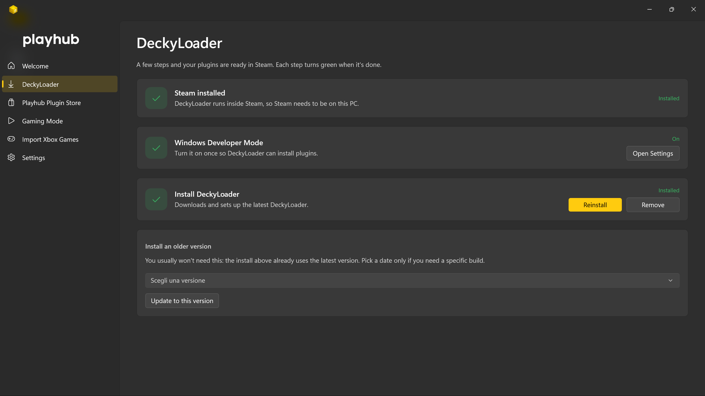
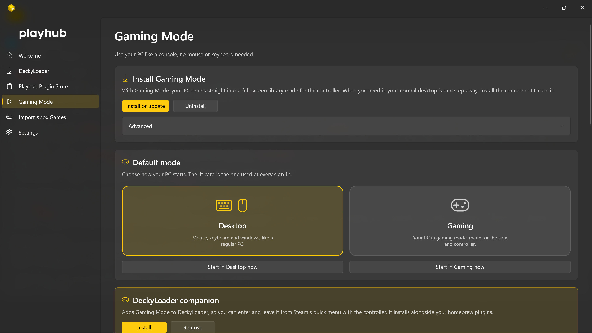
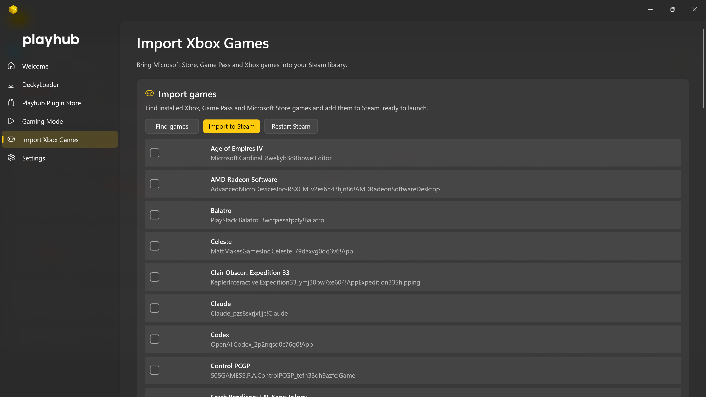
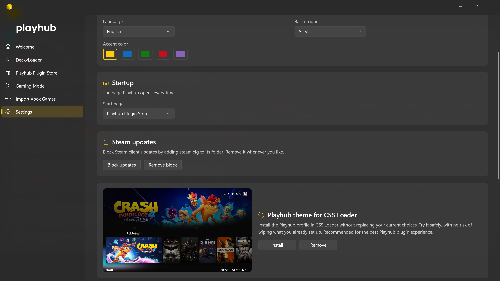

### Your Windows gaming PC, with the soul of a console.

Playhub turns a regular Windows PC into a living-room console: a one-click
**DeckyLoader** installer and plugin store, a true **Gaming Mode** that boots
straight into Steam Big Picture, and import of your **Xbox & Game Pass** games
into Steam. Native, dark by design, in **12 languages**.

 

  

 

<!--
  SCREENSHOT: aggiungi tu le immagini in docs/images/ e linkale qui sotto
  quando vuoi (es. una hero e una galleria). Per ora il README usa solo il logo.
-->

---

## What it does

<table>
<tr>
<td width="50%" valign="top">

### 🧩 DeckyLoader, made easy

Installing DeckyLoader on Windows usually means scripts and guesswork. Playhub
does it from one page: **check the status**, **enable Windows Developer Mode**,
then **install the latest build** — or pick a specific version, **update** or
**remove** it. No PowerShell, no commands to copy.

 

</td>
<td width="50%" valign="top">

### 🎛️ Plugin Store

Install Playhub's **DeckyLoader plugins** with a single click. Normally each one
means turning on Developer Mode inside DeckyLoader and side-loading a `.zip` by
hand — Playhub installs, updates and links every plugin for you, from the app.

 

</td>
</tr>
<tr>
<td width="50%" valign="top">

### 🕹️ Gaming Mode

Decide what your PC does when it turns on: go **straight into Steam Big Picture**
like a console, controller in hand and desktop out of sight — or stay on the
desktop. A background agent makes the handoff seamless; switch back any time.

 

</td>
<td width="50%" valign="top">

### 🟢 Import Xbox PC Games

Bring your **UWP** titles — **Game Pass**, **Xbox app**, **Microsoft Store**
and **Windows Store** games — into Steam as shortcuts with the right artwork. They
launch from Steam and Big Picture like any other game.

 

</td>
</tr>
</table>

 

## Make it yours

Pick your **accent colour** and **background**, and apply the **Playhub theme**
to Big Picture (via CSS Loader). Back up and restore your **Steam artwork**, keep
everything in one Settings page, and use Playhub in **12 languages**. The app
checks GitHub for new versions and tells you in-app when an update is ready.

  

 

---

## Plugins

Playhub curates a small family of plugins that make Big Picture feel finished:

| Plugin | What it adds |
|---|---|
| **Launch Curtain** | A fullscreen customizable loading screen that appears when a game starts to protect your eyes from those ugly splash screens and launchers. |
| **Now Playing** | Your music from Spotify, TIDAL, Apple Music, Deezer, Amazon Music and SoundCloud inside the quick access menu, with cover art, controls and fullscreen mode. |
| **Playhub Metadata** | Descriptions, artwork and achievements for non-Steam games. |
| **Quick Settings** | Handy system toggles from the quick menu. |
| **ThemeDeck** | Game soundtracks and ambience menu sounds in glorious 7.1 upmix. |
| **TrailerHero** | Video trailers directly in your library. |
| **Weather** | A glanceable weather panel. |
| **Playhub Surround** | Audio surround test for the living-room setup. |

 

---

## Download & install

1. Go to the **[latest release](https://github.com/LoZazaMastro/Playhub/releases/latest)**.
2. Download **`Playhub-Setup.exe`** and run it.
3. Pick your language and click **Install**.

Installs **just for your user** — no administrator rights required.

> **Requirements:** Windows 11 (x64) recommended. On Windows 10 the app runs with
> a solid dark theme (no acrylic).

 

---

## Built with

- **.NET 8** · **WinUI 3** · **Windows App SDK** (Fluent 2, dark by design)
- A custom **WPF** installer with an acrylic, themed UI

### Open-source components (MIT)

- [**UWPHook**](https://github.com/BrianLima/UWPHook) © 2016 Brian Lima
- [**VDFParser**](https://github.com/BrianLima/VDFParser) © 2016 Victor Gama
- [**SharpSteam**](https://github.com/BrianLima/SharpSteam) © 2020 Brian Lima

 

---

Made by **Andrea Sgarro** · *ZazaMastro*

© 2026 Andrea Sgarro — released under the [MIT License](LICENSE).

