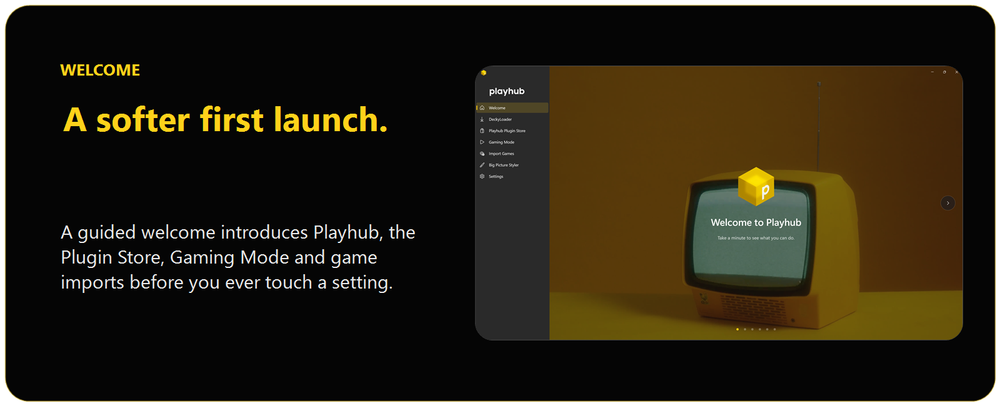

<h3>Your Windows gaming PC, with the soul of a console.</h3>

  <b>Playhub 1.1.8</b> turns a Windows PC into a living-room Steam console:
  DeckyLoader, Playhub plugins, Gaming Mode, Big Picture styling and clean
  Steam shortcuts for Xbox, Game Pass, Epic, GOG and standalone PC games.

Native Windows app. Dark by design. Controller-first. 12 languages.

 

  

 

## What Playhub Does

 

 

 

 

 

 

 

## Built For The Living Room

- Big Picture first: install the Playhub CSS Loader theme and keep your Steam artwork backed up.
- Xbox Game Bar automation: Playhub keeps the controller Game Bar shortcut off in Big Picture, then enables it only while Xbox or Microsoft Store games need it.
- Streaming-ready: Gaming Mode can prepare Sunshine, Apollo or Vibepollo before Steam starts.
- Repair tools: one button checks Gaming Mode, its Decky companion plugin, UWPHook, the agent and configuration.
- Diagnostics: Playhub can create a report on the desktop when something needs investigating.
- Updates: Playhub checks GitHub for new app and plugin versions and notifies you in-app.

 

## Playhub Plugin Family

  

 

 

 

 

 

 

 

### Also In The Store

- Weather: current weather, daily forecasts and hourly forecasts in the Quick Access Menu.
- Playhub Surround: speaker layout tests for stereo, 5.1 and 7.1 living-room setups.
- Gaming Mode companion: a Decky quick menu entry to switch between Gaming Mode and Desktop Mode.
- Steam Controller Access: support tooling for Steam Controller workflows around Xbox and Game Pass shortcuts.

 

## Download And Install

1. Open the [latest release](https://github.com/LoZazaMastro/Playhub/releases/latest).
2. Download `Playhub-Setup.exe`.
3. Run the installer, choose your language and click `Install`.

Playhub installs for your Windows user. Windows 11 x64 is recommended. Windows
10 can run the app with a solid dark theme instead of acrylic effects.

 

## Built With

- .NET 8
- WinUI 3
- Windows App SDK
- Fluent 2
- A custom WPF installer

Open-source components include UWPHook, VDFParser and SharpSteam. Steam
Controller Access third-party notices document SISR by Alia5, VIIPER by Alia5
and Peter Repukat, and USBIP-Win2 by vadimgrn.

Full license details are in
[Source/Playhub/THIRD-PARTY-NOTICES.txt](Source/Playhub/THIRD-PARTY-NOTICES.txt).

 

Made by <b>Andrea Sgarro</b> - <b>LoZazaMastro</b>

(c) 2026 Andrea Sgarro - released under the <a href="LICENSE">MIT License</a>.

  

Steam, Steam Controller and the other product names shown here are trademarks of
their respective owners. Playhub is independent and is not affiliated with,
sponsored by, or endorsed by Valve or any other trademark holder.

