

<h3>Your Windows gaming PC, with the soul of a console.</h3>

  <b>Playhub</b> makes Windows feel at home on the couch:
  Steam-first startup, Decky plugins, game imports and Big Picture polish.

&nbsp;

&nbsp;&nbsp;

 

 

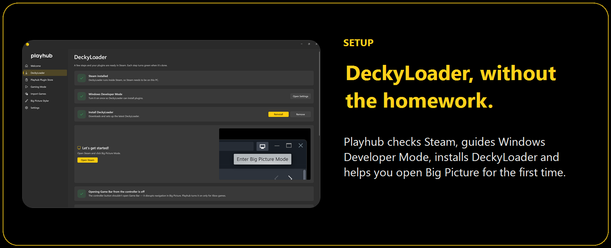
 
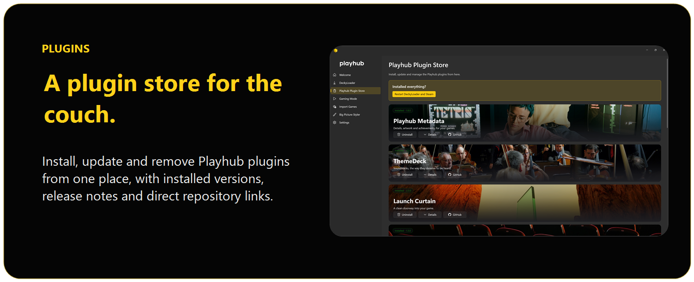
 
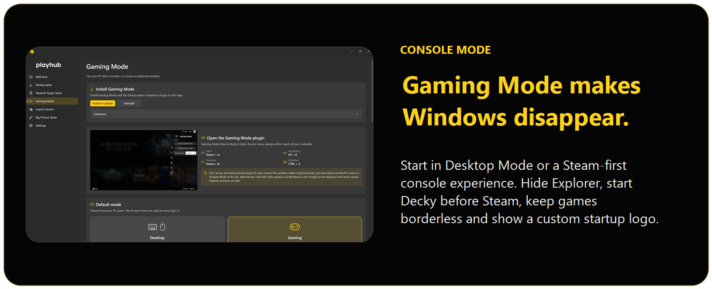
 
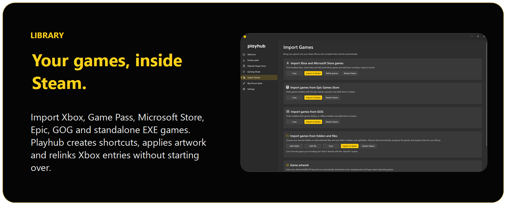
 
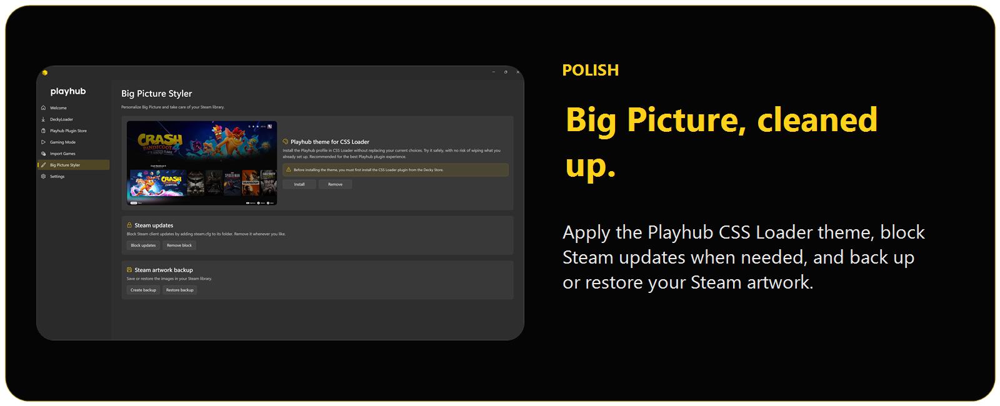
 
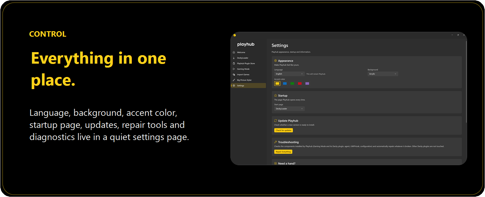

 

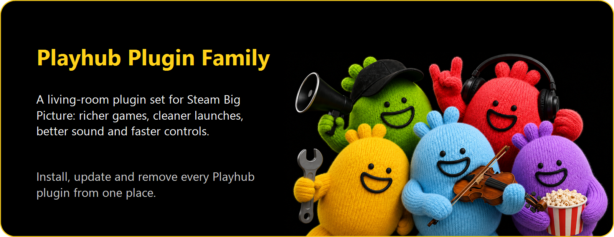
 
<a href="https://github.com/LoZazaMastro/Playhub-Metadata">
  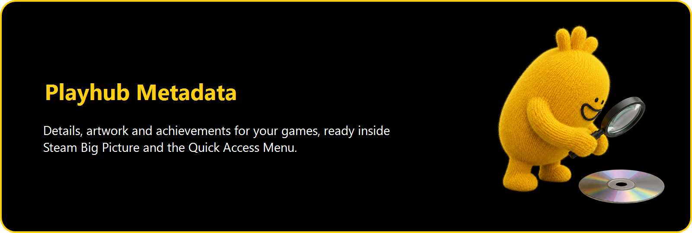
</a>
  
<a href="https://github.com/LoZazaMastro/ThemeDeck-Windows">
  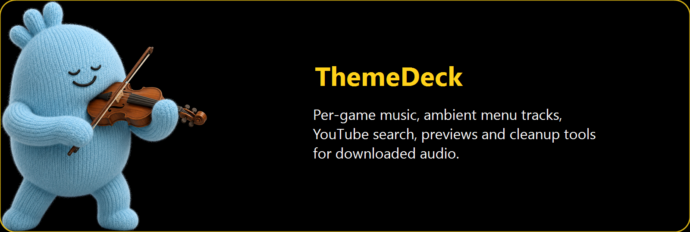
</a>
  
<a href="https://github.com/LoZazaMastro/Launch-Curtain">
  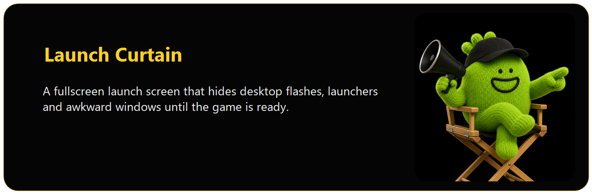
</a>
  
<a href="https://github.com/LoZazaMastro/TrailerHero">
  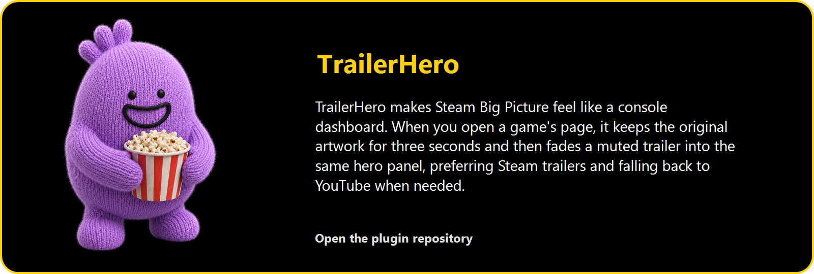
</a>
  
<a href="https://github.com/LoZazaMastro/Now-Playing">
  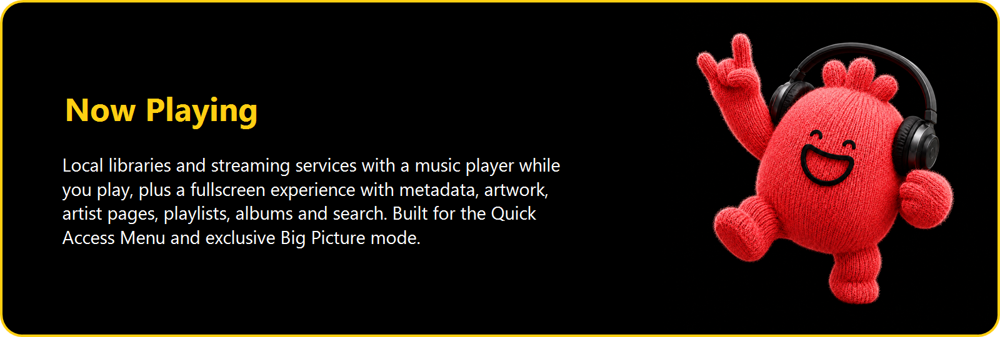
</a>
  
<a href="https://github.com/LoZazaMastro/Quick-Settings">
  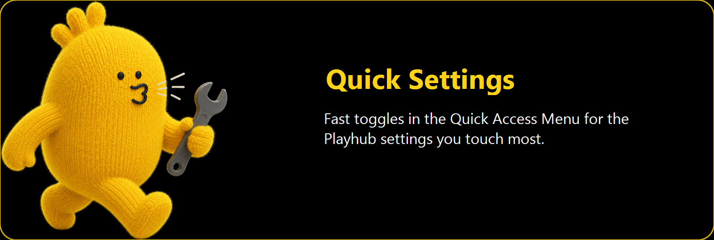
</a>
  

### Other Plugins

- [Weather](https://github.com/LoZazaMastro/Weather): current weather, daily forecasts and hourly forecasts in the Quick Access Menu.
- [Playhub Surround](https://github.com/LoZazaMastro/Playhub-Surround): a small tool for checking your speaker layout in stereo, 5.1 and 7.1, with a living-room-style map and synthesized test sounds inspired by classic video games.

  

## Built For The Living Room

- Big Picture first: install the Playhub CSS Loader theme and keep your Steam artwork backed up.
- Xbox Game Bar automation: Playhub keeps the controller Game Bar shortcut off in Big Picture, then enables it only while Xbox or Microsoft Store games need it.
- Streaming-ready: Gaming Mode can prepare Sunshine, Apollo or Vibepollo before Steam starts.
- Repair tools: one button checks Gaming Mode, its Decky companion plugin, UWPHook, the agent and configuration.
- Diagnostics: Playhub can create a report on the desktop when something needs investigating.
- Updates: Playhub checks GitHub for new app and plugin versions and notifies you in-app.

 

## Download And Install

1. Open the [latest release](https://github.com/LoZazaMastro/Playhub/releases/latest).
2. Download `Playhub-Setup.exe`.
3. Run the installer, choose your language and click `Install`.

Playhub installs for your Windows user. Windows 11 x64 is recommended. Windows
10 can run the app with a solid dark theme instead of acrylic effects.

 

## Open Source

Playhub uses open-source components including UWPHook, VDFParser and SharpSteam.
Full license details are in
[Source/Playhub/THIRD-PARTY-NOTICES.txt](Source/Playhub/THIRD-PARTY-NOTICES.txt).

 

Made by <b>Andrea Sgarro</b> - <b>LoZazaMastro</b>

©2026 Andrea Sgarro - released under the <a href="LICENSE">MIT License</a>.

  

Steam and the other product names shown here are trademarks of their respective
owners. Playhub is independent and is not affiliated with, sponsored by, or
endorsed by Valve or any other trademark holder.

